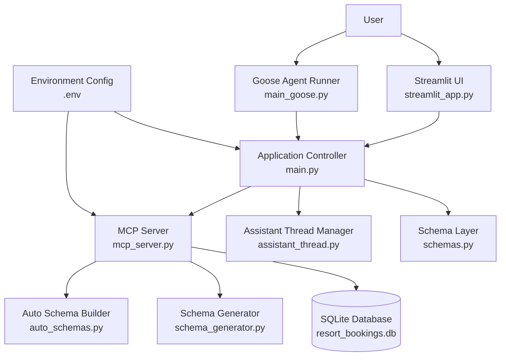

# MCP with Goose Agent

A Python-based project that combines an MCP server, Goose agent integration, a Streamlit interface, schema generation utilities, and a local SQLite database for experimentation and tool-driven workflows.

## Overview

This project is built around the idea of exposing tools and resources through the Model Context Protocol (MCP) and using Goose as the agent layer to interact with them. It also includes helper scripts for schema generation, local conversation threading, and a Streamlit app for simple UI-based interaction.

The repository is designed for local development and prototyping, with configuration stored in `.env` and data persisted in a local `.db` file.

## Project Structure

```text
MCP-with-Goose-Agent/
├── .env
├── .gitignore
├── Dockerfile
├── README.md
├── requirements.txt
├── assistant_thread.py
├── auto_schemas.py
├── main.py
├── main_goose.py
├── mcp_server.py
├── resort_bookings.db
├── schema_generator.py
├── schemas.py
├── streamlit_app.py
├── test.py
```

## Architecture Diagram


## File Description

### Core application files

- `mcp_server.py`  
  Main MCP server implementation. This is the core backend that exposes tools and resources for agent interaction.

- `main_goose.py`  
  Entry point for running the project with Goose as the agent.

- `main.py`  
  General application entry point for local execution or testing flows.

- `streamlit_app.py`  
  Streamlit-based user interface for interacting with the project through a browser.

### Schema and utility files

- `schemas.py`  
  Contains schema definitions used across the project.

- `auto_schemas.py`  
  Handles automatically generated schemas or schema-related helpers.

- `schema_generator.py`  
  Utility for generating schemas programmatically.

- `assistant_thread.py`  
  Manages assistant conversation thread logic or interaction flow storage.

### Data and configuration

- `.env`  
  Stores environment variables and local secrets. This file should not be committed.

- `resort_bookings.db`  
  Local SQLite database used by the application.

- `requirements.txt`  
  Python dependencies required to run the project.

- `Dockerfile`  
  Container setup for running the project in Docker.

### Development and temporary folders

- `__pycache__/`  
  Python cache directory generated automatically.

- `.git_old/`  
  Backup of the old Git metadata after reinitializing the repository. This should not be pushed.

- `test.py`  
  Test or experimental script for validating project behavior.

## Features

- MCP-based tool and resource exposure
- Goose agent integration
- Streamlit UI for local interaction
- Local SQLite database support
- Schema generation and management utilities
- Docker support for containerized execution

## Requirements

- Python 3.10 or above
- pip
- Virtual environment recommended

## Installation

### 1. Clone the repository

```bash
git clone https://github.com/KevinPatrickSS/MCP-with-Goose-Agent.git
cd MCP-with-Goose-Agent
```

### 2. Create and activate a virtual environment

On Windows:

```bash
python -m venv venv
venv\Scripts\activate
```

On macOS/Linux:

```bash
python -m venv venv
source venv/bin/activate
```

### 3. Install dependencies

```bash
pip install -r requirements.txt
```

## Environment Variables

Create a `.env` file in the project root and store all required configuration values there.

Example:

```env
OPENAI_API_KEY=your_api_key_here
DATABASE_PATH=resort_bookings.db
```

Add any other keys required by your MCP server, Goose agent, or UI.

## Running the Project

### Run the MCP server

```bash
python mcp_server.py
```

### Run the Goose agent flow

```bash
python main_goose.py
```

### Run the main app

```bash
python main.py
```

### Run the Streamlit app

```bash
streamlit run streamlit_app.py
```

## Docker

To build the Docker image:

```bash
docker build -t mcp-goose-agent .
```

To run the container:

```bash
docker run --env-file .env -p 8501:8501 mcp-goose-agent
```

Adjust the command if your Dockerfile starts a different service by default.

## Database

This project includes a local SQLite database:

```text
resort_bookings.db
```

If your application depends on this database, keep it locally and exclude it from Git using `.gitignore`.

Recommended `.gitignore` entries:

```gitignore
.env
*.db
.git_old/
__pycache__/
*.pyc
venv/
```

## Suggested Git Setup

Since this project contains local-only files, make sure these are ignored before pushing:

```gitignore
.env
*.db
.git_old/
__pycache__/
*.pyc
venv/
```

If needed, remove already tracked local files with:

```bash
git rm --cached .env
git rm --cached *.db
```

## Typical Workflow

1. Start the MCP server.
2. Launch the Goose-based agent flow.
3. Interact through the Streamlit UI or direct Python entry points.
4. Use the schema utilities to define or update tool schemas.
5. Store and test local data through the SQLite database.


## License

This project is for development and experimentation purposes. Add a license file if you want to make the repository open for reuse.
